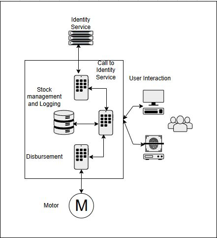

TBD: Fill in all sections below, Writing "N/A" if a section is not applicable to your project.

# Overview

Vending platform: trackable, identity integrated, stock management integrated remotely, specifically for governance relevant industries

# Target Build System
This project will be built leveraging Buildroot

# Hardware Platform
Raspberry Pi 3 Model B Plus Rev 1.3

Stretch Goal: Raspberry Pi Zero 2 W SC1176 [link](https://www.digikey.com/en/products/detail/raspberry-pi/SC1176/15298147?gclsrc=aw.ds&&utm_adgroup=&utm_source=google&utm_medium=cpc&utm_campaign=PMax%20Shopping_Product_Medium%20ROAS%20Categories&utm_term=&utm_content=&utm_id=go_cmp-20223376311_adg-_ad-__dev-c_ext-_prd-15298147_sig-CjwKCAjwp8--BhBREiwAj7og18MdhbM29LcZwpWjNTiTXZhPmdGaFFPicahz__aX0MbnNa4ISJUJWRoCrpYQAvD_BwE&gad_source=1&gclid=CjwKCAjwp8--BhBREiwAj7og18MdhbM29LcZwpWjNTiTXZhPmdGaFFPicahz__aX0MbnNa4ISJUJWRoCrpYQAvD_BwE&gclsrc=aw.ds)

Barcode Scanner: SEN-18088 [link](https://www.digikey.com/en/products/detail/sparkfun-electronics/SEN-18088/14322716?gclsrc=aw.ds&&utm_adgroup=&utm_source=google&utm_medium=cpc&utm_campaign=PMax%20Shopping_Product_Low%20ROAS%20Categories&utm_term=&utm_content=&utm_id=go_cmp-20243063506_adg-_ad-__dev-c_ext-_prd-14322716_sig-CjwKCAjwp8--BhBREiwAj7og15LEvOnd4pqCTEfCy5iSgRbU25ds0fdi55EgCMySdNYmOsp0JvIW1hoC74QQAvD_BwE&gad_source=1&gclid=CjwKCAjwp8--BhBREiwAj7og15LEvOnd4pqCTEfCy5iSgRbU25ds0fdi55EgCMySdNYmOsp0JvIW1hoC74QQAvD_BwE&gclsrc=aw.ds)

KeyPad : 1824 [link](https://www.digikey.com/en/products/detail/adafruit-industries-llc/1824/7244947)

Display: NHD-0216BZ-RN-YBW [link](https://www.digikey.com/en/products/detail/newhaven-display-intl/NHD-0216BZ-RN-YBW/1701194?_gl=1*u09laz*_up*MQ..*_gs*MQ..&gclid=CjwKCAjwp8--BhBREiwAj7og15LEvOnd4pqCTEfCy5iSgRbU25ds0fdi55EgCMySdNYmOsp0JvIW1hoC74QQAvD_BwE&gclsrc=aw.ds)

# Open Source Projects Used
N/A

# Previously Discussed Content
Repurposing portions of aesd-socket 
Repurposing web server from another class

# New Content
Hardware integration, remote identity management, 

# Shared Material
N/A

# Source Code Organization
TBD: Modify the content below:

Buildroot or Yocto Repository will be hosted at [Project Repo](https://github.com/ldmacdonald/ECEA-5307_Projects)

Identity Mock code will be hosted in a repository at [Identity Mock Repo](https://github.com/ldmacdonald/ECEA-5307_Projects](https://github.com/ldmacdonald/ECEA-5307-Identity-Mock))

Hardware Integration code will be hosted in a repository at [Hardware Integration Repo](https://github.com/ldmacdonald/ECEA-5307-Hardware_Integration)

## Team project members:

Dale MacDonald, sole contributor

# Schedule Page
[Schedule](./Schedule.md)
